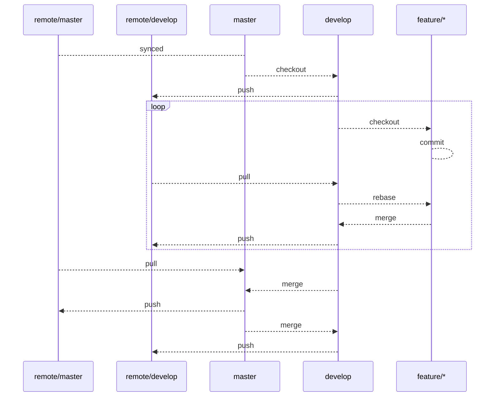

# Git workflow rule

Use git for source code management. Use git registry by github.
We use only remote git registry on github service, currently we don't use issue, pull request and other features. We communicate with tools such as slack.

## Initialize Git

1. Install git on your local.
2. Install Git GUI client. (optional)
3. Create [github](https://github.com/) account.
4. Invite your account to our organization
5. Confirm Connection ssh to github from your local.
6. Install github-cli. (optional)

### Setup git global config

Check does your local installed git.

```sh
$ git --version
git version 2.30.1 (Apple Git-130)
```

Set up git global config.

```sh
# Make sure this is your github account.
git config --global user.name "First-name Family-name"
git config --global user.email "username@example.com"

git config --global pull.ff only
git config --global core.editor 'vim -c "set fenc=utf-8"'
git config --global color.diff auto
git config --global color.status auto
git config --global color.branch auto
```

Connection ssh to github from your local. This is needed to do a git clone.

```sh
ssh-keygen　# generate ssh key
```

Created where your local in `~/.ssh`.
To Register your private key above in github on Account Setting.
Then check connection below.

```sh
$ ssh -T git@github.com
You've successfully authenticated, but GitHub does not provide shell access.
```

## Initialize new project

When you start the new project, You should create new private repository inside organization "allgrow-labo".
The domain will be as follows.

> https://github.com/orgs/allgrow-labo/new-project

### Github-cli

Create private repository with github-cli.

```sh
cd /your/project/
gh repo create allgrow-labo/new-project --private --enable-issues=false --enable-wiki=false

? Would you like to add a .gitignore? No
? Would you like to add a license? No
? This will create the "allgrow-labo/new-project" repository on GitHub. Continue? Yes
✓ Created repository allgrow-labo/new-project on GitHub
? Create a local project directory for "allgrow-labo/new-project"? Yes

cd new-project
```

Create private repository with github-cli from agl_general_template.

```sh
cd /your/project/
gh repo create allgrow-labo/new-project --private --template allgrow-labo/agl_general_template

? This will create the "allgrow-labo/new-project" repository on GitHub. Continue? Yes
✓ Created repository allgrow-labo/new-project on GitHub
? Create a local project directory for "allgrow-labo/new-project"? Yes

cd new-project
```

Create private repository manually.

```
git init
git add README.md
git commit -m "first commit"
git branch -M master
git remote add origin git@github.com/orgs/allgrow-labo/new-project
git push -u origin master
```

## How to start an educational curriculum

Educational curriculum and personal learning repositories should not be included in allgrow-labo.
Add a manager account to manage and evaluate in your personal account github private repository.
The domain will be as follows.

> https://github.com/your-name/educational_curriculum_task01

## Git operation rules

Do not include unnecessary files in your branch. In particular, do not include large files such as design files, vendor directory and node_modules directory.

### git-flow

The work branch is managed using [git-flow](https://datasift.github.io/gitflow/IntroducingGitFlow.html).
The latest delivered data is always the master branch. Operate in the feature branch, develop branch, and master branch. Omit release branch.



Example of starting HTML coding work.

```sh
$ git branch
* master

$ git checkout -b develop
* develop
  master

$ git checkout -b feature/coding
* feature/coding
  develop
  master
```

When requesting a code review.

```sh
$ git checkout develop
$ git pull origin develop
$ git checkout feature/html_cording
$ git rebase develop # This prevents conflicts..
$ git checkout develop
$ git merge feature/html_cording
$ git push origin develop
```

Work range When all work is completed.

```sh
$ git checkout master
$ git merge develop
$ git push origin master
```

### Commit message

Commit your work diligently so that you can understand what you are doing. Be sure to include descriptive comments in the commit.
Commit messages follow the guidelines below.

> https://github.com/conventional-changelog/commitlint/tree/master/@commitlint/config-conventional#type-enum

Example when feature is added.

```sh
git commit -m 'feat(js): create js smooth-scroll'
```

Example when correction is supported.

```sh
git commit -m 'fix(css): edit header media-query'
```

## Cheat Sheet

TODO:

