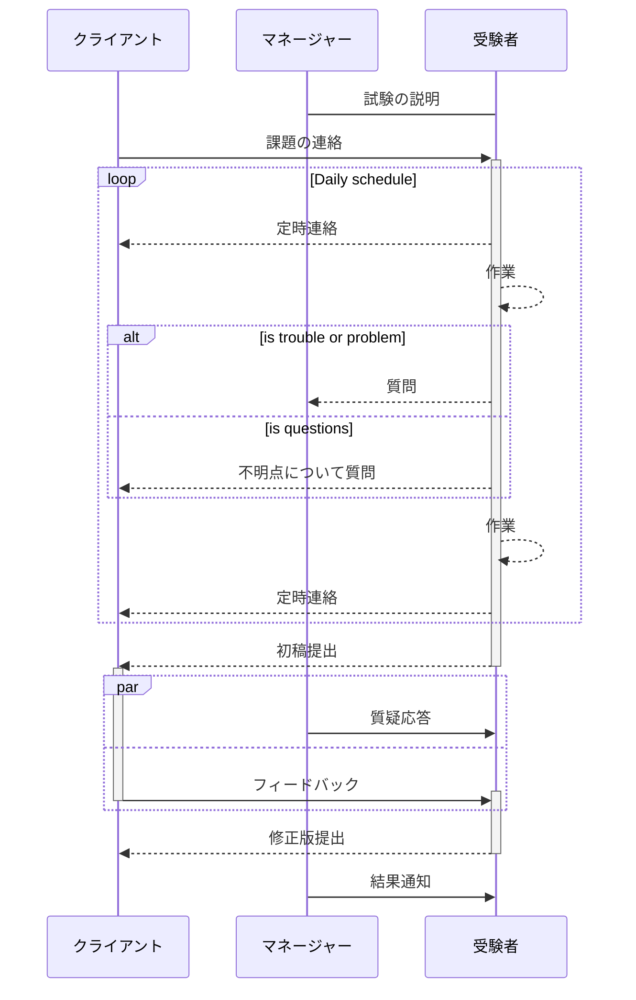
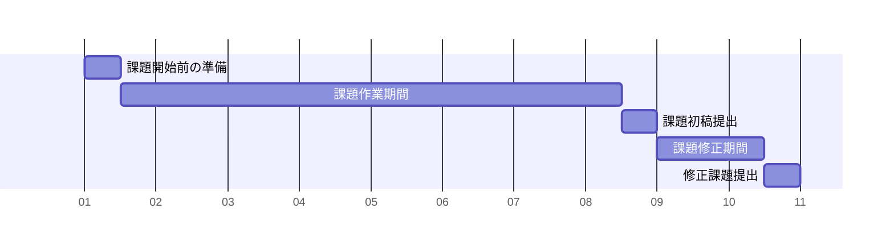

# 採用試験の流れ

## 試験概要

試験では、Soft skill, Operational skill, Technical skillの3項目で合否判定をする。
Soft skill, Operational skill, Technical skillの3項目の全てで合格ラインに達しないものを不合格とする。

*試験の担当者*

- 試験監督: 1名
- 担当マネージャー: 1名

*試験の規則*

- 試験期間中は試験官をクライアントとして扱うこと。以後、本文内で便宜上クライアントと記載する。
- 課題作業中に、課題の進行ができない問題が発生した場合、速やかに担当マネージャーに報告すること。
- 技術的な理由などで後続作業が進行困難な場合は、課題達成を優先させるため、担当マネージャーに相談することも可能である。
- テストサーバーとgithubへコードをアップしクライアントへ報告することで課題提出となる。
- 試験官は実際のクライアントとのやり取りと同様に日本語で指示を行うため、翻訳bot等を使用し指示内容を理解し試験を進めること。
- 翻訳botやグーグル翻訳を使ってもクライアントの指示が理解できない場合、翻訳チームに翻訳サポートを依頼する。

*試験の流れ*



### 試験期間の日程

```
課題開始前の準備：0.5日
課題作業期間：5-8日（目安）
課題初稿提出（質疑応答、修正依頼）：0.5日
課題修正期間：1.5日
課題提出（修正後の採点）：0.5日
```



出題される課題を所定の期間内に完了させ提出する。初回提出後に予備期間として修正期間約1日が与えられる。
受験者は課題開始前の準備期間に課題の内容を確認し、疑問点は予めクライアント（試験官）に連絡する。
受験者は課題開始前の準備期間に課題の内容を確認し、受験者が作業スケジュールを作り試験官に提出する。
課題作業の開始は、準備期間から日付が切り替わった翌日からとする。
課題作業は業務開始から業務終了まで。残業し課題を行う事を禁止しないが、残業する際には報告すること。

## 試験項目

### Soft skill test

```
採点法：一日毎の減点方式
一日の持ち点：10点
合格ライン：不合格日が2日以内
再試験ライン：なし
```

- クライアントを意識した報告連絡相談ができるかを評価する。
- 課題開始前の準備から始まり、期間内の全日で評価を行う。
- 必要な連絡ができれば基本的に減点されることはない。

### Operational skill test

```
採点法：減点方式
持ち点 ： 15点
合格ライン：12点以上
再試験ライン：10点以上
```

- AGLの作業の流れを守れているかを評価する。
- デザイン再現性及び、納品物の品質がAGL基準を満たしているか評価する。
- 納品物からのみ判断することが難しい場合、質疑応答を行う場合がある。

### Technical skill test

```
採点法：減点方式
持ち点 ：採点する項目数（出題される課題により異なるため）
合格ライン：8割以上
再試験ライン：7割以上
```

- 課題初稿提出時の成果物の品質と、修正後の品質から評価を行う。
- 課題提出が予定日程より早い場合も遅い場合も、ほとんどの場合は加点・減点されることは無い。
- 課題提出が予定日程より遅れる場合は報告が必要であり、Operational skillの採点に影響する。
