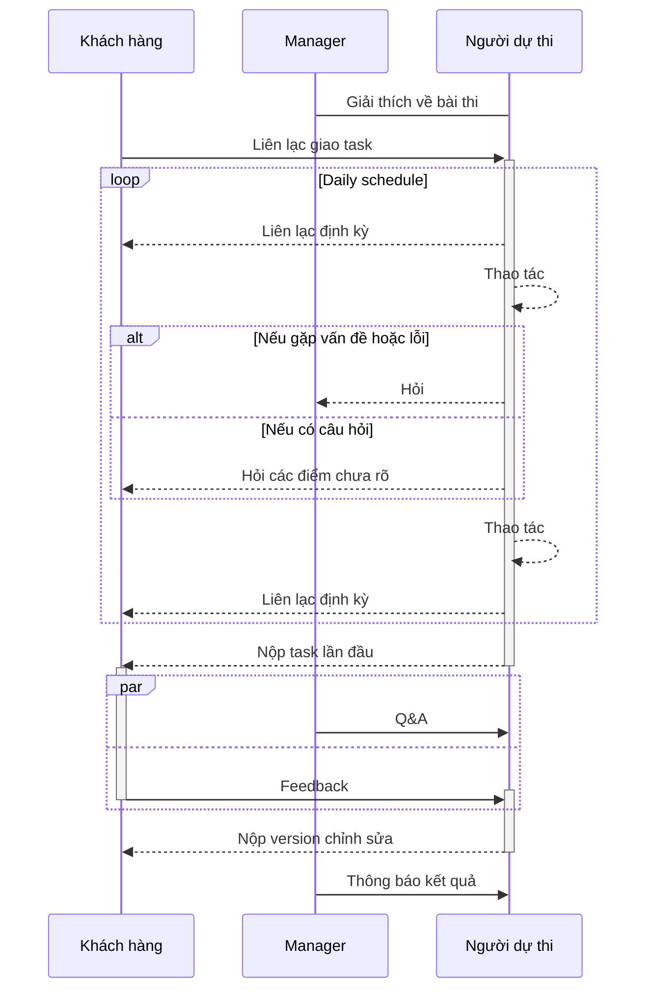
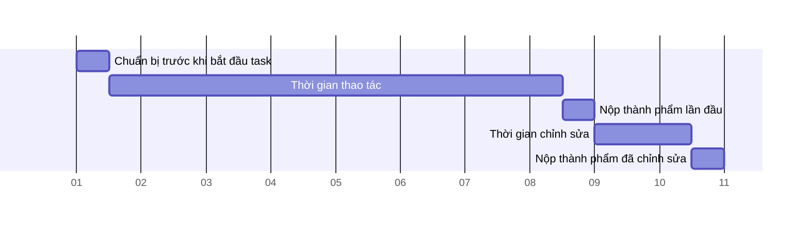

# Quy trình bài thi tuyển dụng
​
## Khái quát về bài thi
​
Ở bài thi sẽ xác định ứng viên đạt hay không đạt dựa trên 3 hạng mục Soft skill, Operational skill, Technical skill.
Các ứng viên sẽ bị đánh rớt nếu không đạt pass line ở cả 3 hạng mục trên.

*Người phụ trách bài thi*

- Giám thị: 1 người
- Manager kỹ thuật phụ trách: 1 người

*Quy định của bài thi*
​
- Xem giám thị như khách hàng trong suốt thời gian kiểm tra. Từ đây trở xuống đến hết văn bản, "giám thị" sẽ được gọi là "khách hàng" để thuận tiện.
- Trong quá trình thực hiện task, nếu gặp sự cố cản trở việc tiến hành task thì phải nhanh chóng báo cáo cho manager kỹ thuật phụ trách.
- Trong trường hợp việc tiến hành các thao tác follow-up gặp khó khăn do trục trặc kỹ thuật, có thể trao đổi với manager kỹ thuật phụ trách để ưu tiên việc hoàn thành task.
- Nộp task bằng cách upload code lên test server và github rồi báo cáo với khách hàng.
- Giám thị sẽ đưa chỉ thị bằng tiếng Nhật giống như khi trao đổi công việc với khách hàng thực tế nên người dự thi sẽ sử dụng bot dịch thuật v.v. để nắm bắt nội dung chỉ thị và tiến hành bài thi.
- Trường hợp đã sử dụng bot dịch thuật hoặc Google Translate nhưng vẫn không hiểu chỉ thị của khách hàng thì có thể nhờ team dịch hỗ trợ.

*Quy trình của bài thi*
​


### Lịch trình kỳ thi 
​
```
Chuẩn bị trước khi bắt đầu task: 0,5 ngày
Thời gian thao tác task: 5 - 8 ngày 
Nộp thành phẩm lần đầu (Q&A, yêu cầu chỉnh sửa): 0,5 ngày
Thời gian chỉnh sửa: 1,5 ngày
Nộp thành phẩm (chấm điểm sau khi chỉnh sửa): 0,5 ngày
```



- Hoàn thành và nộp task được ra đề trong thời gian quy định. Người dự thi được cho thêm khoảng 1 ngày dự bị để chỉnh sửa sau lần nộp task đầu tiên.
- Người dự thi sẽ xác nhận nội dung đề bài trong thời gian chuẩn bị trước khi bắt đầu task, liên hệ trước với khách hàng (giám thị) về các thắc mắc.
- Người dự thi sẽ xác nhận nội dung đề bài trong thời gian chuẩn bị trước khi bắt đầu task, lên schedule thực hiện và nộp cho giám thị.
- Thời gian bắt đầu thực hiện task sẽ tính từ khoảng khắc chuyển qua ngày tiếp theo sau thời gian chuẩn bị.
- Thời gian thực hiện là từ khi bắt đầu làm việc đến khi kết thúc ngày làm việc. Không cấm làm thêm giờ, tuy nhiên nếu có thì phải báo cáo.
​
## Các hạng mục dự thi
​
### Soft skill test
​
```
Phương thức chấm điểm: Khấu trừ điểm hàng ngày
Số điểm ứng viên có sẵn mỗi ngày: 10 điểm
Pass line: Số ngày không đạt là dưới 2 ngày
Re-test line: Không có
```
​
- Đánh giá xem ứng viên có thể báo cáo, liên lạc và trao đổi với khách hàng hay không.
- Việc đánh giá được tiến hành ở tất cả các ngày trong thời gian thực hiện, bắt đầu từ giai đoạn chuẩn bị đến thời điểm bắt đầu thao tác. 
- Nếu ứng viên có thể thực hiện việc liên lạc cần thiết thì về cơ bản sẽ không bị trừ điểm.
​
### Operational skill test
​
```
Phương thức chấm điểm: Khấu trừ điểm
Số điểm ứng viên có sẵn: 15 điểm
Pass line: Từ 12 điểm trở lên
Re-test line: Từ 10 điểm trở lên 
```

- Đánh giá xem ứng viên có thể tuân thủ quy trình làm việc của AGL hay không.
- Đánh giá khả năng tái hiện design và chất lượng sản phẩm xem có đáp ứng đủ tiêu chuẩn của AGL hay không.
- Trường hợp khó đưa ra đánh giá chỉ dựa vào thành phẩm thì có thể cân nhắc thực hiện thêm Q&A.
​
### Technical skill test
​
```
Phương thức chấm điểm: Khấu trừ điểm
Số điểm ứng viên có sẵn: Số hạng mục được chấm điểm (thay đổi tùy thuộc vào đề bài được giao)
Pass line: Từ 80% trở lên
Re-test line: Từ 70% trở lên 
```
​
- Đánh giá dựa trên chất lượng của thành phẩm tại thời điểm nộp thành phẩm lần đầu và chất lượng sau khi chỉnh sửa.
- Trong hầu hết các trường hợp sẽ không cộng thêm hay trừ đi điểm bất kể task được nộp sớm hơn hay muộn hơn so với lịch trình đã định.
- Nếu nộp task trễ hơn so với lịch trình đã định thì cần phải báo cáo và điều này cũng ảnh hưởng đến việc chấm điểm Operational skill.
